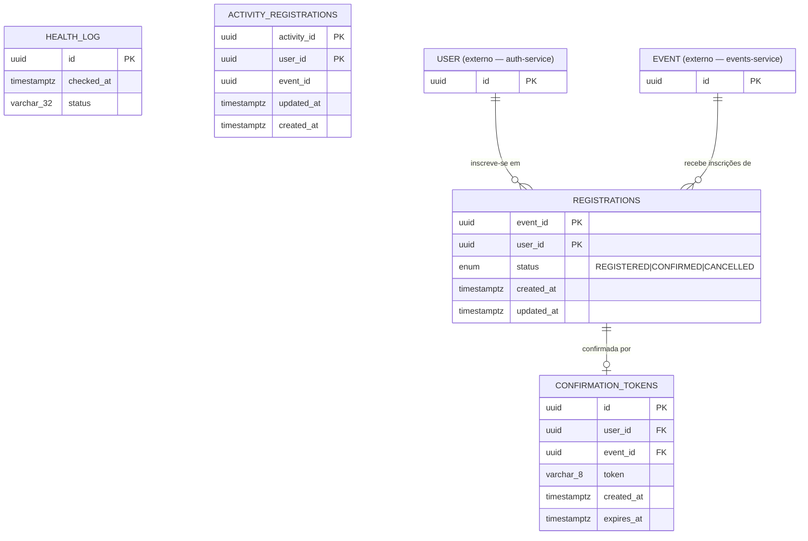

# manifestbolo-t2-registration

Microsserviço responsável por gerenciar inscrições de usuários em eventos da plataforma ManifestoBolo.

---

## Endpoints

A coluna **Auth** indica a autorização exigida: _público_ (sem token), _Bearer_ (qualquer
usuário autenticado), _self/admin_ (o próprio usuário ou um `ADMIN`),
_self/manager/admin_ (o próprio usuário, `MANAGER` ou `ADMIN`) e _manager/admin_.

### Inscrição em eventos

| Método | Rota | Descrição | Auth |
|--------|------|-----------|------|
| `POST` | `/register` | Cria uma inscrição a partir de `{ eventId, userId }` (rota legada) | self/admin |
| `POST` | `/events/{event_id}/guests` | Inscreve um convidado no evento; verifica vagas antes de criar | self/admin |
| `DELETE` | `/events/{event_id}/guests/{user_id}` | Cancela a inscrição (soft delete → `CANCELLED`; idempotente, `204`) | self/admin |
| `POST` | `/events/confirmation/{confirmation_id}` | Confirma a inscrição validando o código alfanumérico de 8 caracteres | público |
| `GET` | `/events/available` | Lista eventos futuros/em andamento que ainda têm vagas | público |
| `GET` | `/events/{event_id}/registrations` | Lista os inscritos de um evento | manager/admin |
| `GET` | `/events/{event_id}/guests/{user_id}/check-in` | Valida se o usuário tem inscrição confirmada (uso interno: check-in) | manager/admin |

### Inscrição em atividades (sub-áreas de um evento)

| Método | Rota | Descrição | Auth |
|--------|------|-----------|------|
| `POST` | `/activities/registrations` | Cria uma inscrição em atividade a partir de `{ activityId, userId, eventId }` | self/admin |
| `GET` | `/activities/{activity_id}/registrations` | Lista os `userId` inscritos em uma atividade | manager/admin |
| `GET` | `/activities/{activity_id}/users/{user_id}` | Busca a inscrição de um usuário em uma atividade | self/manager/admin |

### Inscrições de um usuário

| Método | Rota | Descrição | Auth |
|--------|------|-----------|------|
| `GET` | `/users/{user_id}/registrations` | Lista as inscrições em **eventos** do usuário (inclui canceladas, para histórico) | self/manager/admin |
| `GET` | `/users/{user_id}/activities` | Lista as inscrições em **atividades** do usuário | self/manager/admin |

### Infraestrutura

| Método | Rota | Descrição | Auth |
|--------|------|-----------|------|
| `GET` | `/health` | Health check da aplicação | público |

> **⚠️ Código de confirmação (simulação de e-mail — decisão consciente):** ao criar
> uma inscrição (`POST /register` e `POST /events/{event_id}/guests`), a resposta
> inclui `confirmationId` e `confirmationToken` (o código de 8 caracteres).
>
> Isso **não** é o comportamento de produção: o código só é devolvido na resposta
> porque **este projeto não possui envio de e-mail real**. Em um sistema real o
> `confirmationToken` seria entregue exclusivamente por e-mail e **nunca** trafegaria
> na resposta HTTP da inscrição (expô-lo permitiria confirmar a inscrição de
> terceiros). Aqui ele é exposto de propósito para que o **frontend do T3 mocke o
> "e-mail recebido" em tela** (ex.: um card no canto exibindo o código), fechando o
> fluxo de confirmação sem infraestrutura de e-mail. O `confirmationId` é então
> usado no `POST /events/confirmation/{confirmation_id}`.

**Erros tratados na confirmação:** `400` (código incorreto), `404`
(`confirmation_id` inexistente), `409` (inscrição já confirmada) e `410` (código
expirado). A criação de inscrição rejeita evento inexistente (`404`), evento
encerrado/lotado (`422`) e inscrição duplicada (`409`).

---

## Modelagem Conceitual

### Entidades

**`Registration`** — entidade central do serviço. Representa a inscrição de um usuário em um evento.

| Atributo | Tipo | Notas |
|---|---|---|
| `event_id` | UUID | PK composta — referência ao evento externo |
| `user_id` | UUID | PK composta — referência ao usuário externo |
| `status` | ENUM(`REGISTERED`, `CONFIRMED`, `CANCELLED`) | Status atual da inscrição |
| `created_at` | TIMESTAMP WITH TZ | Preenchido automaticamente |
| `updated_at` | TIMESTAMP WITH TZ | Nullable — preenchido automaticamente |

**`ConfirmationToken`** — token temporário usado para confirmar a inscrição via código alfanumérico (tabela física `authentication_tokens`, modelo `ValidationToken`).

| Atributo | Tipo | Notas |
|---|---|---|
| `id` (`confirmation_id`) | UUID | PK |
| `user_id` | UUID | Parte da FK composta → `registrations(event_id, user_id)`, `ON DELETE CASCADE` |
| `event_id` | UUID | Parte da FK composta → `registrations(event_id, user_id)`, `ON DELETE CASCADE` |
| `token` | VARCHAR(8) | Alfanumérico, exatamente 8 caracteres, gerado pelo backend |
| `created_at` | TIMESTAMP WITH TZ | Automático |
| `expires_at` | TIMESTAMP WITH TZ | Controla a validade do token |

**`HealthLog`** — log de execução do health check (entidade de infraestrutura).

| Atributo | Tipo | Notas |
|---|---|---|
| `id` | UUID | PK |
| `checked_at` | TIMESTAMP WITH TZ | Automático |
| `status` | VARCHAR(32) | Ex: `"ok"` |

**`ActivityRegistration`** — tabela de atividades por usuário e seção.

| Atributo | Tipo | Notas |
|---|---|---|
| `activity_id` | UUID | PK composta — referência à atividade externa |
| `user_id` | UUID | PK composta — referência ao usuário externo |
| `event_id` | UUID | Evento ao qual a atividade pertence (indexado com `user_id`) |
| `updated_at` | TIMESTAMP WITH TZ | Atualizado automaticamente |
| `created_at` | TIMESTAMP WITH TZ | Criado automaticamente |

### Entidades Externas

`User` e `Event` são gerenciados por outros microsserviços e consumidos via HTTP. Este serviço não possui tabelas para eles — os contratos estão em `src/domain/auth/schemas.py` e `src/domain/events/schemas.py`.

### Diagrama ERD



### Relacionamentos

```
[auth-service]          [events-service]
     │                        │
  AuthClient             EventsClient
     │                        │
     └────────┬───────────────┘
              │ (injeção de dependência)
              ▼
      RegistrationService
              │
     ┌────────┴────────┐
     ▼                 ▼
Registration ──1:1──► ConfirmationToken
(event_id PK,        (confirmation_id PK,
 user_id PK)          user_id + event_id idx)
```

| Relacionamento | Cardinalidade | Regra |
|---|---|---|
| User → Registration | 1:N | Um usuário pode se inscrever em vários eventos |
| Event → Registration | 1:N | Um evento pode ter vários inscritos |
| (user_id, event_id) → Registration | UNIQUE | Impede inscrição duplicada |
| Registration → ConfirmationToken | 1:1 lógico | Um token por par `(user_id, event_id)`, com FK composta `ON DELETE CASCADE` |

### Regras de Integridade

- **Inscrição duplicada**: bloqueada no `RegistrationService` via HTTP 409 antes do INSERT, com fallback em `IntegrityError`.
- **Token expirado**: controlado por `expires_at`; validação ocorre na camada de serviço.
- **Confirmação**: valida o `token` e muda o `status` da `Registration` para `CONFIRMED` (o `updated_at` da inscrição é preenchido automaticamente).
- **Cancelamento**: _soft delete_ — muda o `status` para `CANCELLED` mantendo o histórico; repetir o cancelamento é idempotente (`204`).
- **Integridade referencial** com `User` e `Event`: garantida pela aplicação, não por FK no banco.

---

## Arquitetura

Este serviço segue a decisão registrada em [ADR-0001](./app/documentation/adrs/0001-separacao-clients-http-por-microsservico-externo.md): cada microsserviço externo tem um domínio isolado com `client.py` e `schemas.py` dedicados.

```
src/domain/
├── auth/
│   ├── client.py      ← chamadas HTTP ao auth-service
│   └── schemas.py     ← modelos das respostas do auth-service
├── events/
│   ├── client.py      ← chamadas HTTP ao events-service
│   └── schemas.py     ← modelos das respostas do events-service
├── health/
│   ├── controller.py
│   ├── model.py
│   ├── repository.py
│   ├── schemas.py
│   └── service.py
└── registration/
    ├── controller.py
    ├── model.py
    ├── repository.py
    ├── schemas.py
    └── service.py     ← orquestra AuthClient e EventsClient via injeção
```

---

## Lint e Formatação (Ruff)

O projeto usa [Ruff](https://docs.astral.sh/ruff/) para lint e formatação. A configuração está em [`app/pyproject.toml`](./app/pyproject.toml) (regras `E`, `F`, `I`, `N`, `UP`, `B`, `SIM` com `force-sort-within-sections = true` para o isort).

**Antes de qualquer `git push`**, rode os dois comandos a partir da pasta `app/`:

```bash
ruff check . --fix    # aplica lint + ordena imports (regra I001)
ruff format .         # formata o código (aspas, espaços, quebras de linha)
```

Para apenas validar (sem alterar arquivos), como faz o CI:

```bash
ruff check .
ruff format --check .
```

A pipeline do GitHub Actions roda `ruff check app/ --output-format=github` e falha o build se houver qualquer erro — então é mais rápido corrigir localmente antes de pushar.
